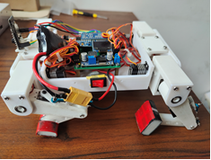
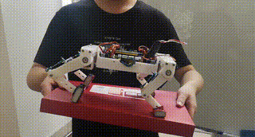

# Attitude Control and Trajectory for Quadruped Robots
 [](https://opensource.org/licenses/MIT)

 
This project integrates sophisticated foot trajectory and attitude control methodologies with classical PID control algorithms, enabling active and adaptive attitude adjustment for the robot on uneven slopes. This is primarily achieved by shifting the robot's center of mass and adjusting its body's posture angles.



Through meticulous planning of the robot's foot trajectory, we optimize overall motion control. To further enhance the quadruped robot's autonomy, an OpenMV camera is employed as a visual sensor, integrated with the PID control algorithm to fine-tune the robot's traveling direction.



The core of the project is based on the STM32 microprocessor, supplemented with the MPU9250 attitude sensor and the OpenMV vision sensor. The entire control system is designed and developed on the Visual Studio Code software platform, efficiently managing the robot's gait and posture control as well as path tracking.


## Environment Dependencies

- **Operating System**: Windows 10
- **Code Generation**: STM32CubeMX
- **IDE**: VSCode
- **Compiler Toolchain**: gcc-arm-none-eabi
- **Debugging Tool**: OpenOCD
- **Vision Development**: OpenMV-IDE

## Code Structure

The following represents the organization of the source code within the project:

```plaintext
Quadruped_Robots
├── Core              // STM32 peripheral initialization code
│   ├── Inc           // Header files for peripheral configuration
│   └── Src           // Source files for peripheral configuration
│       ├── DT.c              // Protocol for UART communication with the host computer
│       ├── filter.c          // Kalman filter implementation for MPU9250
│       ├── main.c            // Main program entry point for the STM32
│       ├── mpu9250.c         // Initialization for I2C and MPU9250 hardware
│       ├── oled.c            // Initialization for SPI and OLED hardware
│       ├── openmv.c          // Protocol for UART communication with OpenMV
│       ├── servo.c           // Servo motor initialization and control
│       ├── show.c            // Algorithms for OLED display
│       ├── tim.c             // Initialization for STM32 timers
│       └── usart.c           // Initialization for STM32 UART
├── Motion            // Control code for the quadruped robot
│   ├── Inc           // Header files for robot control algorithms
│   └── Src           // Source files for robot control algorithms
│       ├── calculate.c       // Inverse kinematics calculations for robot motion
│       ├── control.c         // Gait and posture control, and path tracking algorithms
│       ├── gait.c            // Gait control algorithms for the quadruped robot
│       ├── Posture_control.c // Posture control algorithms for the quadruped robot
│       └── Scheduler.c       // Task scheduler for the quadruped robot
└── Vision            // OpenMV vision control code
    ├── main.py               // Main entry point for the OpenMV program
    ├── LineFollowing.py      // Vision-based line following algorithm
    └── Message.py            // Protocol for UART communication
```

## Installation Guide
To get started with the quadruped robot project, follow these steps:

1. Clone the repository to your local machine:

    ```bash
    git clone https://github.com/djdodsjsjx/Quadruped_Robots.git
    ```

2. Navigate to the project directory:

    ```bash
    cd Quadruped_Robots
    ```

3. Compile the project using the provided Makefile:

    ```bash
    mkdir build
    make
    ```

Future steps might include instructions on how to flash the STM32, how to perform debugging etc., depending on the specifics of the project.

Make sure you have all the necessary tools and dependencies installed before you start.

## Running Guide

After compiling the project, you will obtain an `.elf` file, ready to be flashed onto the target STM32 microcontroller. Debugging with VS Code and the Cortex-Debug extension is a convenient way to run and test the code. Here's how:

1. Ensure your quadruped robot hardware is connected to your computer and all drivers are installed.

2. Open VS Code, making sure the Cortex-Debug extension is installed.

3. Press `F5` or click the green start button in the debug panel to initiate the debug session.

4. VS Code will use the configuration defined in the `launch.json` file to start a debug session, communicating with your STM32 microcontroller via OpenOCD.

5. The code will be flashed to the microcontroller and will start execution. Output can be viewed in the debug console of VS Code, where breakpoints can be set, variables inspected, etc.

Read and follow any specific hardware operation instructions to avoid damage.

### Debugging

To debug the code, you can add breakpoints to lines where you want execution to pause by using the breakpoint bar on the left sidebar of VS Code. When the remote debug session runs, execution will pause at these breakpoints, allowing you to inspect the current status of variables, call stack, and memory state.

## Downloads

The 3D model of the quadruped robot and the STM32 PCB board source code are available for download.

| Dataset         | Model                                                                                                |
| --------------- | ---------------------------------------------------------------------------------------------------- |
| 3D model        | [Google Drive](https://drive.google.com/drive/folders/1vobcyIWCLUGxwW1C1WMGictQdWKiyVe5?usp=sharing) |
| PCB             | [Google Drive](https://drive.google.com/drive/folders/1vobcyIWCLUGxwW1C1WMGictQdWKiyVe5?usp=sharing) |